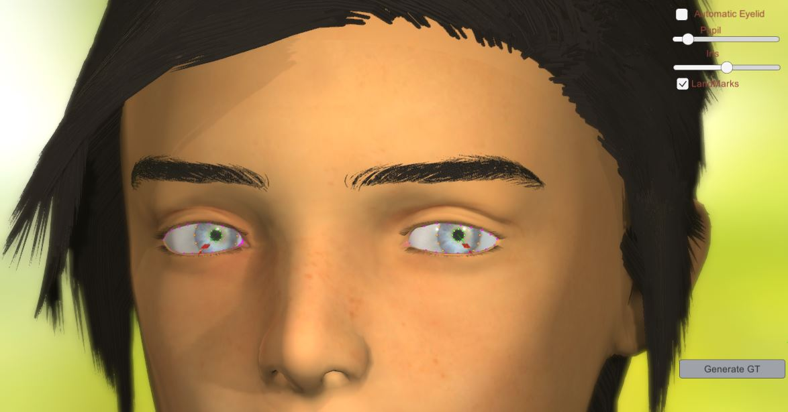
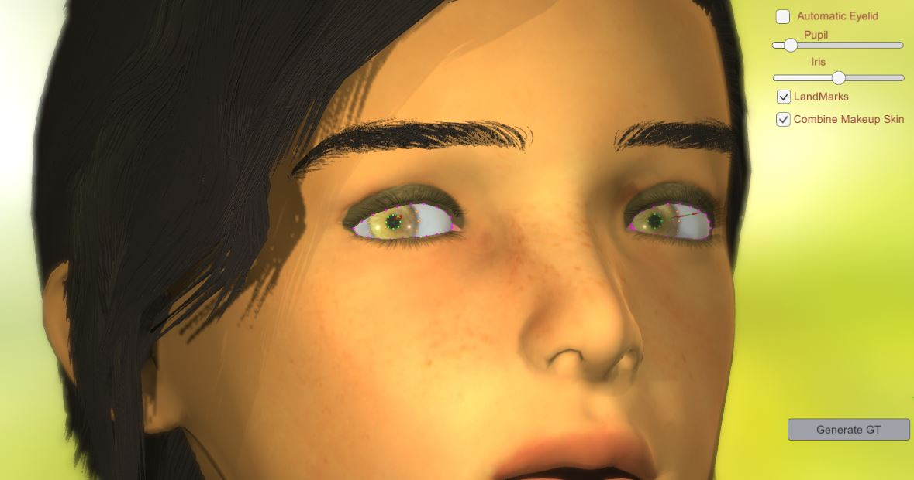
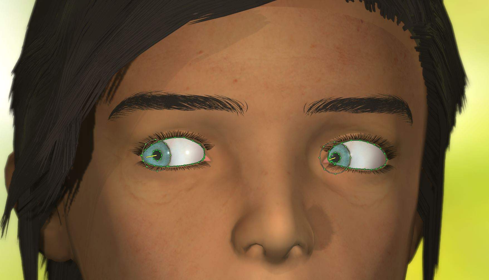

# ELS: EyeLidSimulator
## ELS: GT Generator


Version 0.1b

Version 0.2b


This tool let's you generate millions of different sythetic data, combining skin,iris color, eyelid apperture, etc.. in order to train your AI model to detect different features of the eye:

- Iris 
- Pupil
- Eye-Gaze
- Eyelid

## Download link

ELS 0.2b:

[Download Windows](https://drive.google.com/file/d/1r2LHyweiWH5nJ69QP4bgjp4MfrfVz4RH/view?usp=sharing)

ELS 0.1b:
[Download Windows](https://drive.google.com/file/d/1inJt2stM27DYEf2KLlJv0coNhl7mwVTZ/view?usp=sharing)


## Python 

In order to visualize the generated output in python, you can use "vizualize.py" python script contained in python folder.

```python
python.exe visualize.py --folder ./test/
```


Python output example.

## Manual

### KeyBoard

- **i** : Change Iris color.

- **s** : Change Skin and color.

- **l** : Change Eyeslash type.

- **esc**: Stop the GT generation and enable again the GUI.

- **alt+F4**: Quit.

### Mouse 

- **Left Buttom**: Control the Eye movement.

- **Right Buttom**: Move the Head pose.

- **Wheel**: Close (down) or Open (up) the Eyelid.


### GUI

- **Automatic Eyelid**: Blinks the eyelid automatically.

- **Pupil**: Control the aperture of the pupil.

- **Iris**: Control the size of the Iris.

- **LandMarks**: Show/Hidde the landmarks.

- **Generate GT**: Generate a folder with your time system and create random poses, iris,skin,skin color, and save it into an image and json file.

- **Combine Makeup Skin**: Create both kind of skins, i.e., generate skin with and without makeup.

## JSON File

-**"eyelid_left"**: Left Eyelid 2D backward projection (x,y,z)

-**"eyelid_right"**: Right Eyelid 2D backward projection (x,y,z)

-**"iris_left"**: Left Iris 2D backward projection (x,y,z)

-**"iris_right**": Right Iris 2D backward projection (x,y,z)

-**"pupil_left"**: Left Pupil 2D backward projection (x,y,z)

-**"pupil_right"**: Right Pupil 2D backward projection (x,y,z)

-**"look_vec_left"**: Left Gaze 2D backward projection (x,y,z)

-**"look_vec_right"**: Right Gaze 2D backward projection (x,y,z)

-**"head_rotation"**: Head rotation (Euler) in degrees (Pitch,Yaw,Roll)

## Configuration.xml

This file is located in the root folder and it contains the parameters to generate the GT.

**Head:** roll,pitch and yaw rotation

**Eye:** iris and pupil apperture

**Eyelid:** eyelid apperture 

```xml
<?xml version="1.0" encoding="utf-8"?>
<configuration>
<head>
  <roll max="12.0" min="-12.0" />
  <pitch max="2.0" min="-2.0" />
  <yaw max="20.0" min="-20.0" />    
  <iris  max="10.0" min="3.0"/>
  <pupil  max="120.0" min="-20.0"/>
  <eyelid max="100.0" min="0.0" />
</head>  
</configuration>
```

# Changes

### 0.2b

- Fixed some bugs
- Added Makeup textures
- Added configuration file (configuration.xml)

### 0.1b
 
First beta release.

